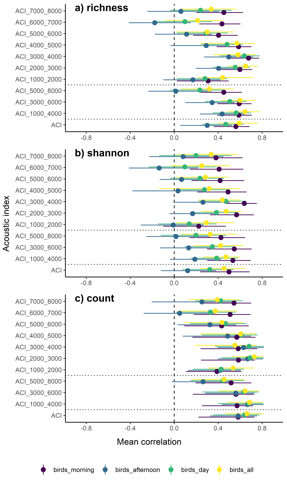
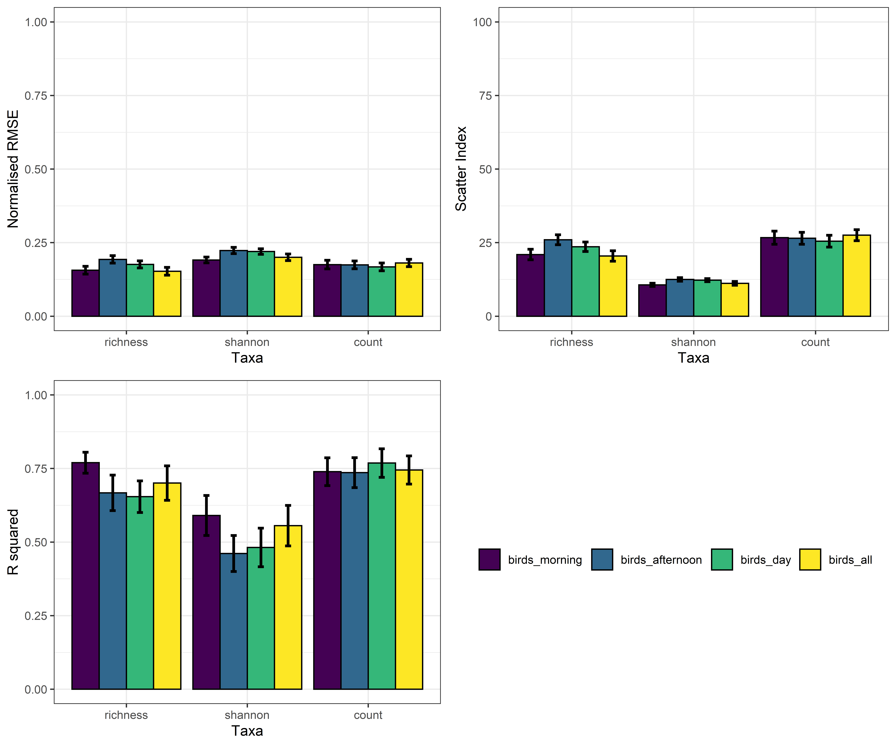
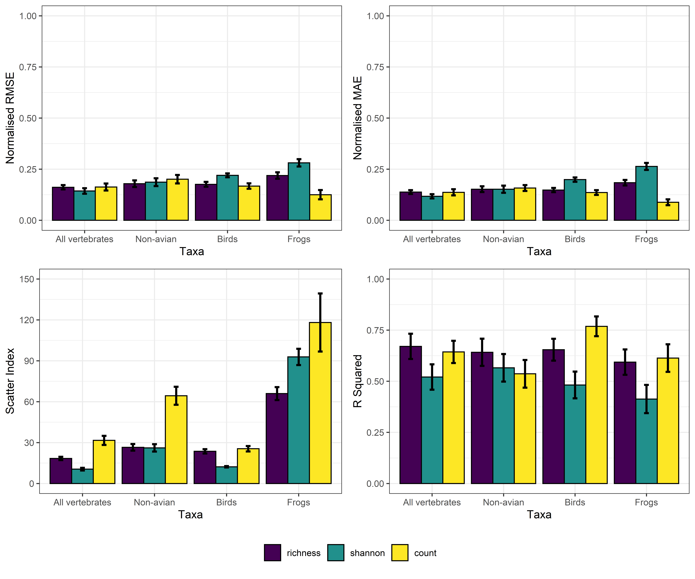
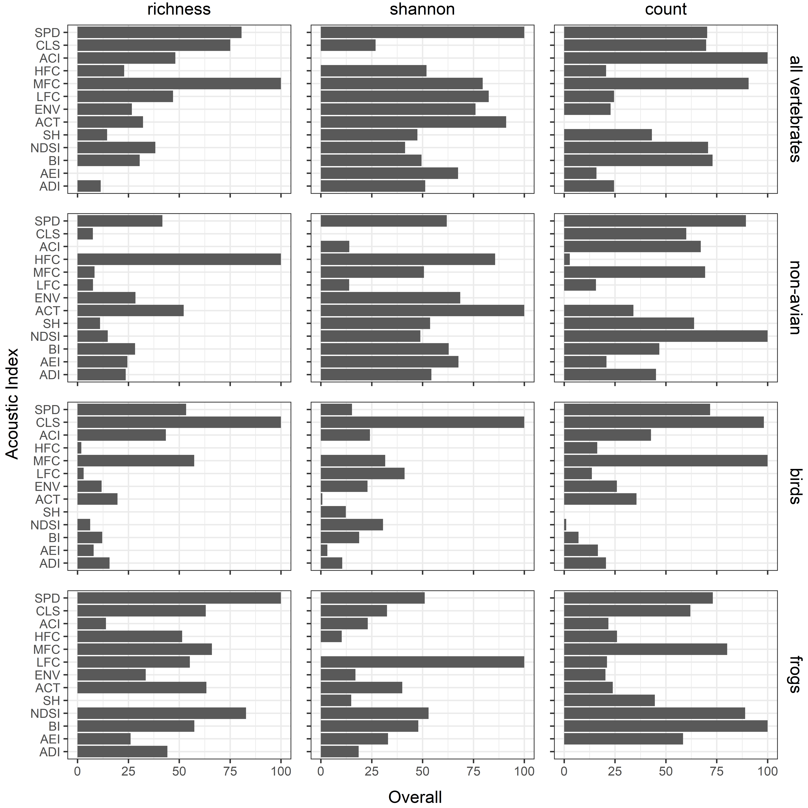

```{r setup, include=FALSE}
knitr::opts_chunk$set(echo = TRUE)
```
# acousticindices_vertebratediversity
Data and analysis scripts for paper looking at correlation between various acoustic indices and vertebrate diversity

Six different acoustic indices were used: ACI, ADI, AEI, BI, NDSI and EVN?

## To do
* 

# Table of Contents  
| [Bootstrap correlations](#bootstrap-correlations)
|   [Different ACI frequency bands (birds)](#different-aci-frequency-bands-birds)
|   [Frogs (evening, night)](#frogs-evening-night)
|   [All taxa](#all-taxa)
| [Random forest models](#random-forest-models)
|   [Bird diversity (morning, day, all)](#bird-diversity-vs-acoustic-indices-morning-day-all)
|   [All vertebrate taxa](#all-vertebrate-taxa)
|   [Variable importance](#variable-importance)

## Bootstrap correlations

### Different ACI frequency bands (birds)
Correlation between biodiversity (richness, shannon diversity, total count) and the acoustic complexity index calculated at different frequency bands. Total ACI, 3kHz and 1kHz frequency binds were used.


### Frogs (evening, night)


### All taxa


## Random forest models

### Bird diversity vs acoustic indices (morning, day, all)
There was little difference in the predictive performance of random forest models on bird biodiversity when using acoustic indices calculated for all recordings, morning recordings (6am-9am), or day recordings (6am-6pm).


### All vertebrate taxa


### Variable importance
